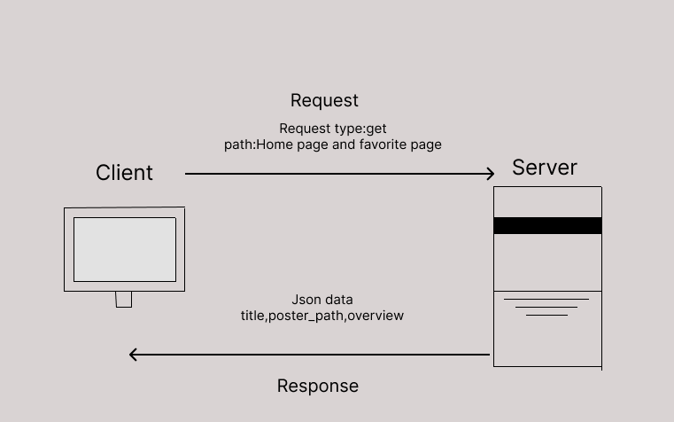

# Movies-Library part 1
movie app that can check the latest movies based on categories.

**Author Name**: Reem Hasan

## WRRC

## Overview

## Getting Started
<!-- What are the steps that a user must take in order to build this app on their own machine and get it running? -->
the steps to this project are
1-download express
2-draw wrrc for your project
3-npm init
4-require express
5-require data
6-build request function
7-have the server listining
## Project Features
<!-- What are the features included in you app -->
1-Express.js Integration
2-Has data movie
3-Routes: There are two pages in the project:
   1-Home Page (/)
   2-Favorite Page (/favorite)
4-Handles errors of type 500 and 404
